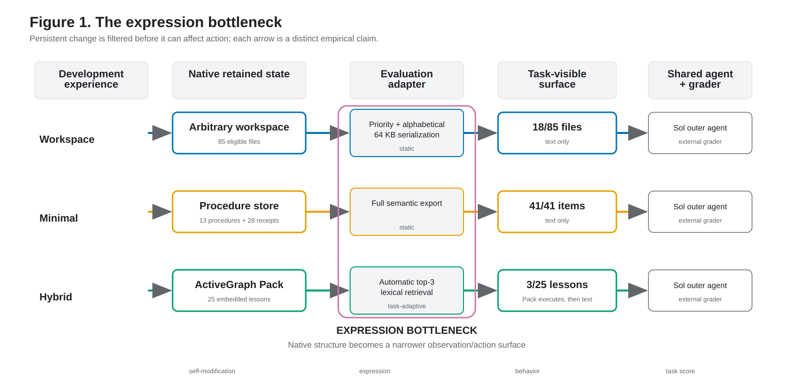
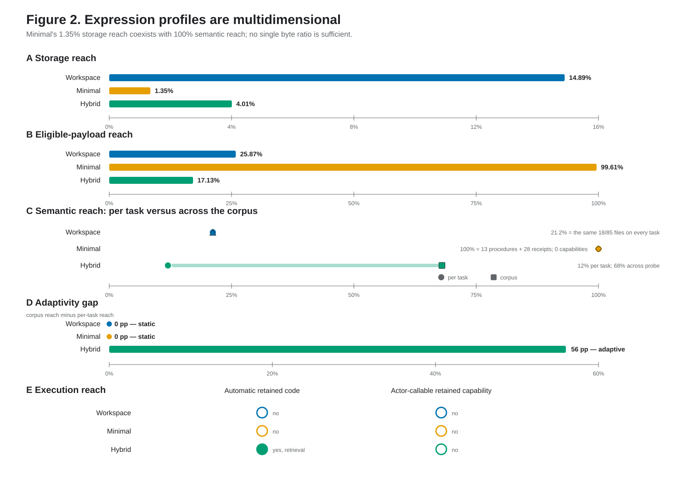
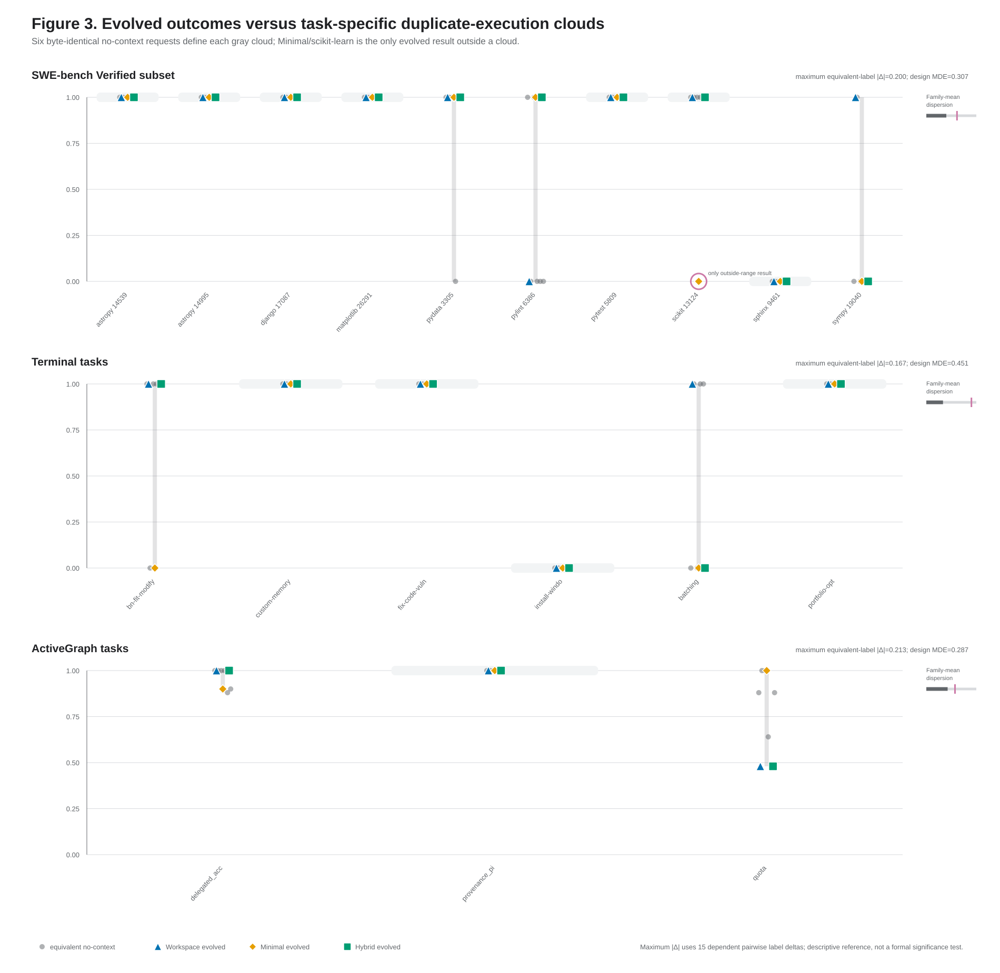
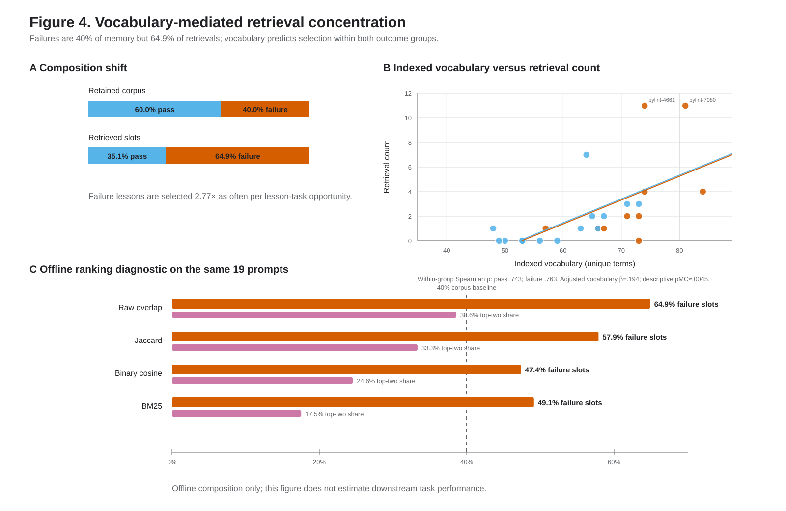
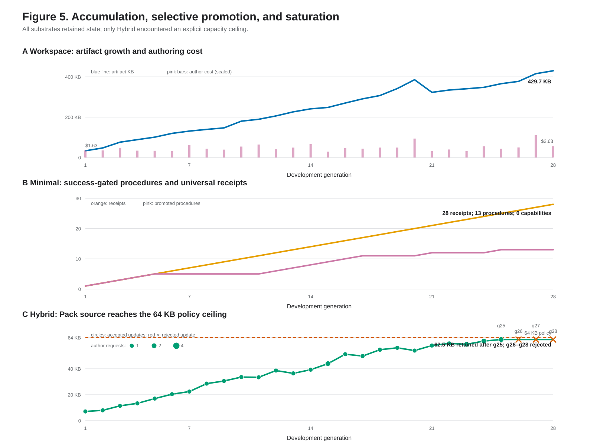

# When Self-Modification Becomes Memory

> Frozen readable companion. The canonical arXiv source is
> [`main.tex`](main.tex); changes to this file require regenerating and
> re-reviewing the LaTeX/PDF.

## An Audited Comparison of Three Retention-Interface Configurations Under a Shared Reflection Layer

### Abstract

Language-model agents can edit prompts, memories, tools, and code, but
self-improvement bundles five evidentiary propositions: retention, expression,
behavioral mediation, task improvement, and recursive improvement. This study
measures retention, expression, and task improvement systematically and audits
behavioral mediation in three selected, trace-dependent cases. Recursive
improvement requires descendant-productivity evidence and is not measured. We
study one development lineage for each of three
substrate-proposal-acceptance-interface configurations under a shared outer
agent, 28-task curriculum, and 19-task cold-restart evaluation. The nominal
state-hidden ablation was actor-visible-equivalent to cold, so the frozen
primary comparison is one evolved lineage against one labeled draw from the
no-context distribution, not a matched-lineage intervention. None of the three
lineages met the written uplift rule, and the design cannot estimate a
population null. Continuous-approximation planning differences were 30.7,
45.1, and 28.7 percentage points for SWE, Terminal, and ActiveGraph; effects
smaller than these coarse values could not be reliably detected by this
design. Six byte-identical initial-request no-context executions differed on 7
of 19 tasks. The sham-benefit conjunct is unevaluable because token load
differed for every configuration and Hybrid also had a byte mismatch. The
shared interface expressed retained structure mainly as text and exposed no
retained invocation handle. Mechanism audits recorded policy-cap saturation,
a common proposal-form bottleneck, and vocabulary-associated selection of
failure-derived lessons. Two outcome-blind model-coding passes agreed that all
84 proposals shared one nonexecutable textual genre; one coder also generated
the proposals, invariant-field kappa is undefined, and interpretive labels
remain exploratory. We contribute an expression profile, an equivalent
duplicates protocol, and a control ladder. The findings are descriptive and
specific to this harness.

## 1. Introduction

Language-model agents now edit their own prompts, memories, tools, and source
code. Prior systems study recursive improvers, runtime self-modification,
coding-agent source changes, branching archives, and descendant-oriented
search. These systems make self-modification easy to observe. Self-improvement
is a different empirical claim. A visible edit establishes that the system
changed itself. It does not establish that the change was expressed at
evaluation time, altered behavior, caused better externally graded outcomes,
or improved the system's capacity to produce useful future changes. Section 9
uses this literature only as conceptual context; comparative feature and
performance claims require an independent primary-source audit before external
circulation.

We separate the statement that an agent improved itself into five constructs:
(1) **retention**, meaning persistent state changed; (2) **expression**,
meaning retained state reached the evaluation-time policy; (3) **behavioral
mediation**, meaning retained state causally changed the policy's trajectory or
resource use; (4)
**task improvement**, meaning externally graded held-out performance rose
beyond matched controls and stochastic spread; and (5) **recursive
improvement**. These are distinct evidentiary propositions, not ordinal
performance levels. Retention and actor-visible expression can be established
descriptively; behavioral mediation, task improvement, and recursive
improvement generally require counterfactual or lineage contrasts. This study
systematically measures retention, expression, and task improvement. It records
descriptive behavioral differences across all nine configuration-family cells
and audits three selected complete-chain traces; those observations do not
establish a general causal mediation effect. Descendant productivity is the
required operationalization of recursive improvement and is not measured here.

We study those links in a heavily instrumented comparison of three persistent
self-modification substrates chosen for the breadth of their native update
surfaces: an arbitrary rewritable workspace, a success-gated procedure store,
and a governed, hash-pinned executable ActiveGraph Pack. Each traversed the
same ordered 28-task development curriculum and then faced 19 disjoint
held-out tasks across three families after a cold restart. The design used
external graders, four arms, immutable receipts, hash-bound adjudication, and a
frozen success criterion. It also had one development lineage per
configuration, one model, and small task families. The orchestration and local
ActiveGraph family were self-built; SWE and Terminal used external official
graders, and every empirical finding is scoped to the recorded harness. The frozen result
is null: none of the three recorded lineages met the criterion. This
paper explains why that null is informative and why several favorable and
unfavorable results inside our data dissolve under audit.

The audit measures mechanisms that recur across agent systems. First, budgeted
context is a common route from memory to later action. Under that route, our
three substrate-interface configurations delivered between 12% and 100% of
their declared retained items per task, exposed no retained invocation handle
in the actor-visible action schema, and expressed native structural change to
the acting policy almost entirely as text. These percentages are
within-substrate coverage measures rather than comparable quantities of useful
information. Second,
single-run task estimates can conceal substantial outcome variability. Our six
no-context labels issued byte-identical first requests per task, seed included,
and still differed on 7 of 19 tasks. Their family-level means spanned 2/10
tasks (20.0 points) on SWE and 1/6 task (16.7 points) on Terminal; the
continuous-score ActiveGraph span was 21.3 points. Third,
placebo context can change the computation it is meant to control. On SWE, the
Workspace evolved arm solved 8/10 tasks and the sham solved 6/10, creating a
20-point evolved-minus-sham contrast; the six equivalent no-context labels
on the same ten tasks already ranged from 6/10 to 8/10. Fourth, lexical
retrieval and append-only retention created observable selection and capacity
effects. A top-three retriever over-selected broad-vocabulary failure lessons,
and the Pack eventually blocked three consecutive updates at its policy limit.

The shared reflection layer created a proposal-form bottleneck before
configuration-specific acceptance and native mutation. Two separately executed
outcome-blind model-coding passes using the recorded model identifiers
`gpt-5.6-sol` and `gpt-5.6-terra` over all 84 update proposals
assigned every proposal to the same representational genre:
natural-language, append-only, nonexecutable, operational guidance with no
specified activation. Interpretive fields were less stable across coders and
remain exploratory pending human coding. One coder, Sol, was also the model
that generated the proposals; Terra supplied the second pass. The compact
package records distinct model identifiers and does not establish provider or
pretraining independence between them. The cross-model consistency finding
concerns the proposal layer. Native Workspace edits and Pack source
changes remained structurally real and heterogeneous.

The receipts cut in both directions. An apparent transfer success involved an
evolved SymPy pass matched by a no-context run that produced essentially the
same fix, while the retained SymPy lesson concerned a different mechanism. An
apparent retrieval failure scored exactly at the minimum of six equivalent
no-context runs. The one evolved result outside its task's exact equivalent
range was a regression in which retained context accompanied a larger invalid
intervention and the ablation produced the smaller correct fix. A tie-aware
conditional exchangeability calculation expected 12/7 (1.71) outside-range
results and observed one, so the case is a mechanistic trace rather than a
population or chance detection. A case audit that can show when favorable and
unfavorable causal stories are unsupported is a minimum requirement for
interpreting individual trajectories.

Prior systems motivate several distinct optimization and memory questions.
This review round did not independently audit their feature coverage or
reported performance, so the manuscript does not use a comparative matrix or
quantitative prior-system claims as novelty evidence. Applying the present
instruments in independently audited systems is a concrete next test.

This paper contributes six instruments and observations specified for reuse:

1. a five-construct decomposition separating retention, expression,
   behavioral mediation, task improvement, and recursive improvement;
2. an **expression profile** measuring storage reach, eligible-payload reach,
   semantic-unit reach, selection adaptivity, and execution reach;
3. an **equivalent duplicates** protocol that creates task-level empirical
   dispersion references from executions with byte-identical initial requests;
4. a **control ladder** organizing eight control designs by the nuisance they
   address and the claims they license;
5. mechanism checks for **vocabulary-mediated retrieval concentration**,
   source-policy saturation, and common-template reflection-proposal
   homogenization; and
6. a receipt-bound compact release with graders, requests, artifacts, and an
   adjudication ledger; complete trajectory traces remain in a separately
   gated archive pending disclosure review and deposit.

The scope is a within-study diagnostic demonstration. It does not supply a
population estimate, a universal architecture ranking, or a universal
auditability-expressivity law. The expression bottleneck was created by the
implemented common interface, and that fact is central to the result. The
reflection template determined what could be proposed, the acceptance gate
determined what survived, the retriever and adapter determined what was
expressed, and the execution stack determined what a score could mean. The
interface and the acceptance mechanism are part of the self-improving system.

**Figure 1: The expression bottleneck.** The study separates retention,
expression, behavioral mediation, task improvement, and recursive improvement.
Retention is necessary but does not identify later score improvement or
recursive self-improvement. The bold bottleneck is the implemented adapter
boundary. It does not imply that all auditable interfaces reduce expressivity.

The contribution status is explicit:

| Proposition | Status in this study | Recorded evidence | Boundary |
|---|---|---|---|
| Retention | Systematically exercised | Immutable state generations and receipts for all three lineages | Establishes persistent change only |
| Expression | Systematically measured | Frozen adapter emissions and semantic-unit coverage across the held-out probe | Establishes actor-visible availability only |
| Behavioral mediation | Descriptive resource differences plus three audited complete-chain traces | Model/tool/token summaries and the Section 8 trace cases | Does not identify a general causal mediation effect; complete traces are gated |
| Task improvement | Systematically measured | All 57 configuration-task outcomes and nine family-level controlled contrasts | One lineage per configuration; descriptive task-resampling intervals |
| Recursive improvement | Proposed external endpoint | Descendant productivity is specified as the required operationalization | Not measured in this study |

## 2. Measurement framework

Let \(R_i^t\) denote retained state for configuration \(i\) after development
generation \(t\). Let \(A_i(R_i^t, x)\) be the evaluation adapter for task
\(x\), \(O_i^t(x)\) the observation and action surface emitted by the adapter,
\(\pi(O_i^t(x), x)\) the induced acting policy, \(Y_i^t(x)\) the external task
score, and \(M_i^t\) the productivity of the process that creates useful
descendants. The five constructs correspond to different comparisons:

1. Retention: \(R_i^{t+1} \ne R_i^t\).
2. Expression: \(O_i^{t+1}(x) \ne O_i^t(x)\).
3. Behavioral mediation: retained state causally changes the induced policy
   trajectory or resource use.
4. Task improvement: expected external score increases beyond matched controls
   and relevant outcome spread.
5. Recursive improvement: the productivity \(M_i^t\) of generating useful
   descendants increases.

This decomposition prevents evidence from moving silently between levels. The
five propositions have different logical status and need not move together. A
new file establishes retention. A serialized lesson establishes possible
expression. A changed trace establishes behavioral mediation. An external
score contrast supports task improvement. Recursive improvement is the
construct; descendant productivity is its operationalization. It requires
evidence that earlier changes improved later update production.

The title's threshold is operational rather than metaphysical: a
self-modification becomes memory in this study when it survives restart and is
eligible to reach a later policy through the recorded adapter. That threshold
combines retention with actor-visible expression. It does not establish
behavioral mediation, task improvement, or recursive improvement.

### 2.1 Expression profile

A single byte ratio cannot compare heterogeneous stores. Minimal's complete
SQLite state is mostly provenance, while its semantic export is small.
Workspace bytes mix source, tests, instructions, and records. Hybrid executes
a Pack query before the actor, so direct byte delivery omits runtime
activation. We therefore report five structured axes:

1. **storage reach**: unique bytes copied into the initial actor-visible
   context divided by bytes in a declared canonical serialization of the
   complete frozen retained-state snapshot;
2. **eligible-payload reach**: those copied bytes divided by the canonical
   retained byte spans admitted by the adapter's frozen eligibility rule;
3. **semantic-unit reach**: declared substrate-native retained items surfaced
   per task, plus their union across the probe, divided by the frozen item
   inventory;
4. **selection adaptivity**: whether selection is explicitly conditioned on
   task input, accompanied by the per-task-to-probe-union coverage expansion;
   and
5. **execution reach**: whether retained code runs automatically and how many
   retained invocation handles appear in the actor-visible action schema.

Semantic units are files for Workspace, typed procedures, capabilities, or
receipts for Minimal, and lessons for Hybrid. The unitization rule and item
types are frozen before evaluation. A Workspace file counts once when any
bounded prefix of that file reaches the actor; completeness is reported
separately. These ratios measure coverage within one
substrate and must not be used to compare quantities of useful information
across substrates. The coverage-expansion gap measures selection turnover; it
does not by itself show that selection is relevant or beneficial. Interfaces
without byte-copy semantics should report the byte axes as not applicable and
declare a proxy rather than force a ratio.

The expression profile is diagnostic rather than ordinal. Greater reach can
increase useful transfer, interference, cost, or all three.

### 2.2 Control ladder

The control ladder organizes controls by the nuisance they address and the
inference they license. Rungs 3 through 6 are alternative payload controls,
not a monotonic sequence in which every higher number dominates every lower
number.

| Rung | Intervention and held-fixed variables | Licensed inference |
|---|---|---|
| 1. Cold floor | Same model, task, harness, and budget; no development lineage | Model-and-harness floor |
| 2. Matched state-hidden ablation | Same developed lineage and evaluation stack; retained learned state hidden; some actor-visible or trajectory-relevant lineage channel must remain distinct from cold | Effect of enabling the retained-state channel only when that distinct channel is verified |
| 3. Opaque byte-size sham | Replace retained payload with seeded opaque text; report observed byte ratio and token load | Sensitivity to adding an opaque payload of the recorded size |
| 4. Token-matched neutral sham | Match tokenizer, position, and token count using a preregistered candidate corpus and blinded relevance screen | Payload effect after equalizing first-call token load |
| 5. Semantic sham | Insert plausible units selected from disjoint task families under a blinded relevance screen | Sensitivity to plausible but screened-unrelated guidance |
| 6. Structure-preserving sham | Seed and record the shuffle unit; preserve real-unit count, schema, and token budget while permuting content or metadata | Sensitivity to the retained structure apart from its original mapping |
| 7. Equivalent duplicates | Repeat executions with byte-identical initial model requests, model, seed field, task image, harness, and budgets; later trajectories may diverge | Observed within-task execution dispersion under identical initial requests |
| 8. Native-interface ablation | Hold retained state, task, model, and budgets fixed while enabling or disabling native execution; record resulting latency and observation differences | Effect of the native execution path under the stated downstream changes |

The present study separably implements rungs 1, 3, and 7. It records the
lineage state hash required by rung 2, but the cold-ablation adapters validate
and then suppress that state without exposing a lineage-derived channel to the
actor. Cold and cold ablation therefore collapse at the actor-visible
intervention boundary. Rung 2 is not separably implemented here. The other
rows are operational specifications for follow-up designs rather than
empirical controls claimed here.

## 3. Study design

All three configurations used the same `gpt-5.6-sol` outer coding agent, brokered
tool protocol, task ceilings, grader boundary, and common reflection step.
Accordingly, the experiment compares three proposal, acceptance, retention,
and interface configurations downstream of one shared textual proposal
generator. It does not compare unconstrained native self-modification
processes. The configurations differed in retained state:

- **Workspace v1.2** could rewrite and retain an arbitrary workspace tree.
- **Minimal v2** stored every scalar receipt and promoted only successful
  experiences as procedures or deterministic capabilities. This recorded
  lineage produced 13 procedures and zero deterministic capabilities, so the
  capability-execution path was never exercised.
- **Hybrid Packs** used a model-authored, tested, hash-pinned ActiveGraph Pack
  to store and retrieve lessons.

The native mutation units differ in breadth. The score comparison concerns
their implemented common interface and does not order their native ceilings.

Each configuration traversed the same 28-task development curriculum: 20
SWE-bench Verified issues, six Terminal-Bench 2 tasks, and two local
Ouro-ActiveGraph-50 systems. Evaluation used 19 disjoint held-out tasks: ten
SWE-bench Verified issues, six Terminal-Bench 2 tasks, and three
Ouro-ActiveGraph-50 systems. SWE and Terminal used official binary verifiers.
The ActiveGraph family used normalized scores from 50 sealed checks. The local
benchmark and the Hybrid Pack both use ActiveGraph technology, creating a
structural author-built overlap. The sealed checks and the unfavorable Hybrid
ActiveGraph result, -10.0 points versus its labeled no-context draw, mitigate simple
directional bias but do not remove that conflict.

For each configuration and held-out task, the study ran four arms:

- **evolved**, with retained development state enabled;
- **cold ablation**, with the same lineage hash validated and learned state
  hidden;
- **sham**, with a seeded opaque artifact intended to approximate the evolved
  context size;
  and
- **cold**, with no development state.

Source inspection after Round 1 confirmed that cold and cold ablation have the
same task, model, seed field, tools, workspace, system instructions, empty
retained-context field, and later actor-visible tool protocol. The hidden
lineage hash is validated for cold ablation but never reaches the actor. The
frozen primary estimand, paired `evolved - cold ablation`, is therefore an
evolved contrast against one labeled draw from the six actor-visible-equivalent
no-context arms rather than a separable matched-lineage intervention. We keep
that contrast as the frozen decision rule and report pooled-six and
leave-the-matched-ablation-out sensitivities in Section 4.

The written frozen rule required benefit over the labeled cold-ablation draw
and sham, a nominal
95% task-resampling interval above zero in at least two families including SWE
or Terminal, valid cold reload, and no material development regression. This
was an operational decision rule for the recorded probe rather than a claim of
population-level interval coverage. The later source audit makes the labeled
ablation a no-context draw, and the observed sham token and byte mismatches make
the sham-benefit conjunct unevaluable. These limitations cannot convert a
failed written rule into evidence of uplift.

The information boundary excluded hidden tests, expected outputs, private
cases, grader logs, and oracle artifacts from lineage state. Each accepted
generation produced an immutable directory whose manifest bound architecture,
parent run, development experience, artifact size, and hash. Evaluation
occurred after cold reload. The study specification is
[`research/local_study.json`](../research/local_study.json), SHA-256
\texttt{8313d219\allowbreak{}71452704\allowbreak{}893200d2\allowbreak{}022718fe\allowbreak{}ca985142\allowbreak{}ae32fe7d\allowbreak{}16932d34\allowbreak{}a0e0d581},
committed with frozen status at study commit
\texttt{55984389\allowbreak{}4578141d\allowbreak{}fbd39b7b\allowbreak{}ae2246db\allowbreak{}76e57bde} on 2026-07-17T18:30:38-07:00.
The compact release does not preserve an independently witnessed timestamp for
the first development call, so we call this a frozen study specification and
decision rule rather than an externally registered preregistration. The
manuscript package reviewed in Round 1 was commit
\texttt{8bdff502\allowbreak{}cc08be96\allowbreak{}8b21bbe5\allowbreak{}ebf177d4\allowbreak{}9879a0fb}.

The study completed 84 development attempts and 228 held-out attempts. Failed
attempts remained in the denominator. Six SWE runs reached the frozen
3,600-second task limit. Six Terminal agents reached the 1,800-second limit,
and completed verifiers returned zero. One ActiveGraph grader contradicted a
receipt-bound parsable submission; one sealed grader-only retry of the
hash-identical artifact recovered 24/50. No model attempt was rerun and no raw
row was rewritten. The adjudication index binds the raw report, datasets,
changed analytical row, and evidence by SHA-256.

Scores remain separate by family. Nominal 95% descriptive task-resampling
intervals use 10,000 deterministic percentile-bootstrap draws. Each draw
resamples the paired per-task arm differences jointly with replacement. With
one lineage and ten, six, and three held-out tasks, no frequentist coverage is
asserted. The three-task ActiveGraph interval is especially discrete and
unstable and is not displayed in the headline outcome table.

The compact package records the outer model identifier and the byte-identical
initial requests. It does not record a provider guarantee of deterministic
sampling, endpoint immutability, temperature, top-p, or context-window
settings. The seed field is therefore a best-effort request parameter rather
than a determinism guarantee.

## 4. Frozen outcome rule and pooled-control sensitivity

None of the three recorded lineages met the frozen uplift criterion. This is a
descriptive result from one development lineage per configuration. The labeled
comparator is one draw from the actor-visible-equivalent no-context
distribution, not a separable matched-lineage intervention, and the study
cannot estimate a population null. Table 1 reports the binary families as
fractions and percentages. For context, the six equivalent no-context labels
ranged from 6/10 to 8/10 on SWE and from 4/6 to 5/6 on Terminal despite
byte-identical initial requests within each task. The continuous-approximation
planning differences were 30.7 percentage points for SWE, 45.1 for Terminal,
and 28.7 for ActiveGraph. Effects smaller than these coarse, descriptive values
could not be reliably detected by this design; the values are not decision
thresholds.

| Family | Configuration | Evolved | Labeled no-context draw | Evolved minus labeled draw; nominal 95% descriptive task-resampling interval | Sham | Evolved minus sham |
|---|---|---:|---:|---:|---:|---:|
| SWE, 10 tasks | Workspace | 8/10 (80.0%) | 8/10 (80.0%) | 0/10 (0.0 pp) [0.0, 0.0] | 6/10 (60.0%) | +2/10 (+20.0 pp) |
| SWE, 10 tasks | Minimal | 7/10 (70.0%) | 6/10 (60.0%) | +1/10 (+10.0 pp) [-20.0, +40.0] | 7/10 (70.0%) | 0/10 (0.0 pp) |
| SWE, 10 tasks | Hybrid | 8/10 (80.0%) | 7/10 (70.0%) | +1/10 (+10.0 pp) [0.0, +30.0] | 8/10 (80.0%) | 0/10 (0.0 pp) |
| Terminal, 6 tasks | Workspace | 5/6 (83.3%) | 4/6 (66.7%) | +1/6 (+16.7 pp) [0.0, +50.0] | 3/6 (50.0%) | +2/6 (+33.3 pp) |
| Terminal, 6 tasks | Minimal | 3/6 (50.0%) | 5/6 (83.3%) | -2/6 (-33.3 pp) [-66.7, 0.0] | 4/6 (66.7%) | -1/6 (-16.7 pp) |
| Terminal, 6 tasks | Hybrid | 4/6 (66.7%) | 4/6 (66.7%) | 0/6 (0.0 pp) [0.0, 0.0] | 4/6 (66.7%) | 0/6 (0.0 pp) |
| ActiveGraph, 3 continuous-score tasks | Workspace | 82.7% | 100.0% | -17.3 pp; n=3, interval not displayed | 96.0% | -13.3 pp |
| ActiveGraph, 3 continuous-score tasks | Minimal | 96.7% | 88.0% | +8.7 pp; n=3, interval not displayed | 100.0% | -3.3 pp |
| ActiveGraph, 3 continuous-score tasks | Hybrid | 82.7% | 92.7% | -10.0 pp; n=3, interval not displayed | 82.7% | 0.0 pp |

Intervals equal to [0, 0] are degenerate because every paired task difference
was zero; they do not imply population-level certainty. The labeled no-context
column preserves the frozen comparison even though source inspection later
showed that it was one draw rather than a separable lineage intervention. The
sham columns are descriptive only: sham first-call token load was 1.88 to 2.43
times the incremental evolved token load per byte, and Hybrid's sham was only
56% to 58% of mean evolved context bytes. The sham conjunct of the written rule
is therefore formally unevaluable and supplies no benefit-control decision in
this probe.

The pooled-six sensitivity recomputes the descriptive mean contrast against
all actor-visible-equivalent no-context labels. In Workspace, Minimal, and
Hybrid order, the evolved-minus-pooled deltas are +6.7, -3.3, and +6.7 points
for SWE; +11.1, -22.2, and -5.6 points for Terminal; and -9.9, +4.1, and -9.9
points for ActiveGraph. Leaving each configuration's labeled draw out of
its reference gives +8.0, -6.0, and +6.0; +10.0, -20.0, and -6.7; and -8.4,
+3.2, and -9.9 points, respectively.

The corresponding nominal 95% task-resampling intervals, again in Workspace,
Minimal, and Hybrid order, are as follows. For SWE, pooled-six intervals are
[-8.3, +26.7], [-30.0, +18.3], and [-3.3, +21.7] points; leave-one-out
intervals are [-10.0, +32.0], [-32.0, +16.0], and [-4.0, +20.0]. For Terminal,
pooled-six intervals are [0.0, +27.8], [-50.0, 0.0], and [-25.0, +8.3];
leave-one-out intervals are [0.0, +30.0], [-46.7, 0.0], and [-30.0, +10.0].
For ActiveGraph, pooled-six intervals are [-33.3, +3.7], [-6.3, +18.7], and
[-33.3, +3.7]; leave-one-out intervals are [-29.6, +4.4], [-5.6, +15.2], and
[-32.0, +2.4]. No interval has a lower bound above zero. The sensitivities
therefore do not produce the required positive pattern in two families, and
the no-uplift decision is unchanged. The exact nine-cell calculation is
[`data/generated/equivalent-control-sensitivity.csv`](data/generated/equivalent-control-sensitivity.csv).

The table and sensitivity establish persistent evaluation after development
and the absence of frozen uplift. They do not explain whether retained state was
available, whether it changed behavior, or whether visible contrasts exceeded
outcome variability. Sections 5 through 7 audit those links.

## 5. Expression bottleneck

All three substrates created cold-loadable state:

| Substrate | Accepted updates | Accepted after passed task | Accepted after failed task | Final retained product |
|---|---:|---:|---:|---|
| Workspace | 25/28 | 13 | 12 | 429,731-byte workspace |
| Minimal | 13/28 | 13 | 0 | 13 procedures, 0 capabilities, 28 receipts |
| Hybrid | 25/28 | 15 | 10 | 25 lessons in a 62,506-byte Pack source |

These receipts establish retention. The expression profile shows what could
reach later behavior:

| Substrate | Storage reach | Eligible-payload reach | Semantic coverage: per task; probe union | Selection adaptivity and coverage expansion | Execution reach: automatic; actor-visible retained handles |
|---|---:|---:|---:|---|---|
| Workspace | 14.9% | 25.9% | 18/85 files (21.2%); 18/85 (21.2%) | static; 0 pp | none; 0 handles, with retained tools hidden |
| Minimal | 1.35% | 99.6% | 41/41 typed items (100%); 41/41 (100%) | static; 0 pp | none; N/A because 0 retained executable units |
| Hybrid | 4.0% mean | 17.1% mean | 3/25 lessons (12%); 17/25 (68%) | task-conditioned top-three query; 56 pp turnover | automatic pre-task Pack query; 0 actor-visible handles |

Minimal supplies an observed counterexample, in this implementation, to
storage reach as a sufficient metric. Its database and provenance artifacts
were large, giving 1.35%
storage reach, while the adapter exported all declared semantic units. Those 41 units
comprised 13 procedures and 28 receipts. None was a deterministic capability.
The byte numerators and denominators are Workspace 64,000/429,731 storage and
64,000/247,411 eligible payload; Minimal 24,767/1,839,823 and
24,767/24,865; and Hybrid mean 10,677/266,265 and 10,677/62,319.
For Minimal, the 98-byte difference is between the complete export file and
the canonical serialization of its three admitted arrays; all 41 semantic
units were present. For Hybrid, the 62,319-byte eligible denominator sums the
25 lesson payloads and excludes the Pack source wrapper, explaining its
difference from the 62,506-byte final source size.

Workspace exposed 17 complete files and a bounded prefix of an eighteenth.
Under the frozen semantic-unit rule, a file counts once when any bounded
prefix reaches the actor, yielding 18/85; completeness is reported separately. All
post-priority files came from the alphabetically early `_development/`
directory, and the actor could not invoke retained tools. Minimal delivered the
same complete export to every task. Hybrid alone selected different learned
units by task: three of 25 per task and 17 of 25 across the probe. Its Pack
executed a retrieval before each task, while the actor received only the
returned text and could not call the Pack interactively.

The common adapter therefore narrowed each native substrate in a different
way. Workspace was truncated and static. Minimal was semantically complete and
static. Hybrid used task-conditioned selection with 56 points of probe-union
coverage expansion. No actor-visible action schema contained a retained
invocation handle. Minimal had no retained executable unit, while Workspace
and Hybrid retained executable material that the actor could not invoke on
demand. This supports an expression bottleneck in the implemented interface. A
general auditability-expressivity tradeoff remains a hypothesis for a future
interface intervention.

**Figure 2: Expression is a profile.** Five axes are reported: storage reach,
eligible-payload reach, semantic coverage with per-task and probe-union
submeasures, selection adaptivity, and execution reach with automatic and
actor-visible submeasures. Percentages are within-substrate coverage measures
and do not compare quantities of useful information. Minimal's 41 declared
units are 13 procedures and 28 receipts; none is executable. Hybrid conditions
top-three selection on task text, exposing three of 25 lessons per task and 17
across the probe. Its Pack runs automatically in the adapter and supplies no
on-demand actor-visible invocation handle.

## 6. Equivalent duplicates and control interference

The six no-context labels were Workspace cold, Workspace ablation, Minimal
cold, Minimal ablation, Hybrid cold, and Hybrid ablation. For each task, their
first model requests were byte-identical, including seed. Their outcomes varied
on 7 of 19 tasks. The remaining 12 tasks were stable: ten fixed passes and two
fixed failures. Later model sampling, tool outputs, timing, and trajectories
were uncontrolled execution variation, but actor-visible task, model, seed
field, tools, workspace, system instructions, retained-context field, and tool
protocol were the same. Three of these six labels are also the labeled
ablation comparators in Table 1, so the dispersion reference and frozen
comparator are overlapping rather than independent samples.

| Family | Tasks | Tasks variable across six labels | Descriptive ICC(1,1) | Maximum of 15 dependent pairwise label-mean gaps | Continuous-approximation planning diagnostic, nominal 80% power |
|---|---:|---:|---:|---:|---:|
| SWE | 10 | 3 | 0.72 | 2/10 tasks (20.0 pp) | 30.7 pp |
| Terminal | 6 | 2 | 0.66 | 1/6 task (16.7 pp) | 45.1 pp |
| ActiveGraph | 3 | 2 | 0.31, highly unstable | 21.3 pp | 28.7 pp |

The one-way random-effects ICC treats tasks as targets and the six named
no-context labels as exchangeable single replicate executions on the observed
score scale. It is a descriptive repeatability coefficient, and the
three-target ActiveGraph value is especially unstable. The design-sizing
diagnostic is \((1.96 + 0.842) \times \widehat{SE}\), using a two-sided nominal
\(\alpha=0.05\), 80% power, and the within-task variance across the six
equivalent labels. It is a continuous normal approximation for a paired mean
contrast. On the binary families it does not represent an attainable observed
score increment. The three-task ActiveGraph value is illustrative only and
must not be used to interpret the continuous-score spread as a stable power
estimate. Neither planning quantity is a decision threshold.

All discriminative variation in the no-context probe was concentrated in seven
tasks that changed outcome under equivalent requests. Stable tasks still
provide one-sided opportunities: fixed passes can expose regressions and fixed
failures can expose gains. Minimal's evolved failure on
`scikit-learn__scikit-learn-13124`, against six equivalent passes, was the
only one of 57 evolved configuration-task results outside an exact
task-specific equivalent range. Under a tie-aware conditional exchangeability
calculation, the expected count is 12/7 (1.71): 1/7 among 36 cases on stable
control tasks and 11/7 among 21 cases on variable control tasks. The observed
count was one and therefore supplies no positive chance detection. Method and
family breakdown are recorded in
[`data/generated/outside-range-exchangeability.json`](data/generated/outside-range-exchangeability.json).

The maximum of the 15 absolute pairwise label-mean gaps is reported for each
family. The 15 values are dependent functions of six labels, and the labels
are not randomized evolution replications. The maximum is a descriptive
dispersion reference rather than a significance threshold.

The sham comparison exposes a second control problem. Workspace SWE evolved
minus sham was +2/10 tasks (+20.0 points) because the evolved and ablation arms
each solved 8/10 tasks while the opaque sham solved 6/10; equivalent
no-context labels on the same tasks also ranged from 6/10 to 8/10. On
Terminal, Workspace evolved minus sham was +2/6 tasks (+33.3 points) because
evolved solved 5/6, ablation solved 4/6, and sham solved 3/6; equivalent labels
on those tasks ranged from 4/6 to 5/6.
The SWE sham family score fell within the equivalent-label range, at 6/10
against 6/10 to 8/10. The Terminal sham fell below all six equivalent family
means, at 3/6 against 4/6 to 5/6. With six dependent draws, a seventh
observation below the observed minimum is consistent with interference and
does not establish it.
The sham consumed approximately 1.88 to 2.43 times as many incremental
first-call tokens per byte as evolved context, depending on configuration.
Its context bytes exactly matched evolved context for Workspace and Minimal.
For Hybrid, the 6,093-byte sham was 56% to 58% of the mean evolved context
across families.
Byte matching therefore controlled artifact size while leaving tokenization,
semantic load, and interference uncontrolled for Workspace and Minimal; Hybrid
also retained a substantial byte-size mismatch.

**Figure 3: Task-level initial-request duplicate spread.** For each of 19
tasks, gray points show six no-context outcomes generated from byte-identical
initial model requests; colored marks show the three evolved outcomes. Later
trajectory inputs may diverge. Seven tasks varied under the duplicate
executions and 12 were stable.
Minimal/scikit-learn is the only evolved configuration-task outcome outside the
observed duplicate-execution range. The bar is the maximum of 15 dependent
absolute pairwise label-mean gaps and is descriptive rather than a formal
significance threshold. Neither the bar nor the planning diagnostic is a
decision threshold.

Across all nine configuration-family cells, the recorded evolved execution
also differed from the pooled no-context reference on at least one mean
resource measure among model calls, tool calls, input tokens, output tokens,
and cost. The complete descriptive summary is
[`data/generated/behavior-mediation.csv`](data/generated/behavior-mediation.csv).
These systematic resource differences establish observed trajectory or
resource divergence. They do not identify retained state as the causal
mediator because the comparison is one lineage against overlapping execution
labels and the later trajectories are stochastic. Section 8 therefore limits
mechanism-level interpretation to three selected trace audits.

## 7. Mechanism audits

### 7.1 Vocabulary-mediated retrieval concentration

Hybrid retained 25 lessons, including 15 from passing development attempts and
ten from failed attempts. Across 19 held-out tasks, the top-three retriever
filled 57 slots. Failure-derived lessons occupied 37/57 slots (64.9%) despite
forming 10/25 of the corpus (40%). Two failed Pylint lessons occupied 22/57
slots (38.6%). Only 17/25 lessons were ever retrieved, and 5/57 slots shared a
repository prefix with the held-out task.

The implemented ranker counted set overlap between task words and an index
containing suite, task identifier, title, scope, and trigger terms.
Failure-derived lessons had broader indexed vocabularies. The raw enrichment,
37/57 retrieval slots from 10/25 failure-derived lessons, is the total
association. Indexed vocabulary
correlated with retrieval count within passing lessons
(\(\rho=0.743, n=15\)) and failed lessons (\(\rho=0.763, n=10\)). In the
descriptive regression `retrievals ~ indexed vocabulary + failure flag`,
vocabulary had a coefficient of 0.194 retrievals per additional term and the
adjusted failure coefficient was -0.093 retrievals. A 50,000-draw
descriptive within-status label-permutation diagnostic shuffled vocabulary
values within pass/fail strata, refit the vocabulary coefficient, and counted
absolute coefficients at least as large as observed with a plus-one Monte
Carlo correction. It gave \(p_{\mathrm{MC}}\approx0.0045\). This conditional
reference requires exchangeability of vocabulary labels within status; the 25
lessons form one fixed corpus and compete for 57 retrieval slots, so the value
is neither causal nor population inference.

Offline re-ranking the same prompts changed the selection pattern without new
model calls. Failure slots fell from 37/57 under raw overlap to 33/57 under
Jaccard, 27/57 under binary cosine, and 28/57 under BM25. BM25 surfaced 22/25
lessons and reduced the top-two share from 22/57 to 10/57. These diagnostics
are consistent with vocabulary-mediated selection in the implemented overlap
ranker. They do not identify whether failure status has additional effects
outside that path and do not show that alternative retrieval improves
downstream task scores.

**Figure 4: Vocabulary-mediated retrieval concentration.** Hybrid's
retained corpus was 40% failure-derived, while failures occupied 37/57
retrieval slots (64.9%). Retrieval count increased with indexed vocabulary
within both success and failure groups. Because failure status plausibly acts
through indexed vocabulary breadth, the adjusted regression is a mechanism
diagnostic rather than an attribution of signal away from failure. It does not
establish an effect on held-out score.

### 7.2 Capacity saturation

Hybrid Pack source grew from 7,053 to 62,506 bytes. Generation 25 first
exceeded the 64,000-byte policy and succeeded after one repair. Every candidate
in generations 26 through 28 remained over the cap after four author or repair
requests; the closest final candidate was 65,928 bytes. Mean authoring requests
rose from 1.0 over the first five generations to 3.2 over the last five, and
mean authoring cost rose from $0.249 to $2.114.

The policy rejection and retained-state plateau record source-policy saturation
under the implemented 64,000-byte cap and append-oriented design. The cap was
not varied, so this is not evidence of an inherent append-only limitation.
Task identity and difficulty are confounded
with generation order, so the cost trend is descriptive. The result does not
establish a general limitation of ActiveGraph or executable memory.

**Figure 5: Accumulation, rising effort, and saturation.** Panel A shows
Workspace artifact growth and authoring cost; panel B shows Minimal's
universal receipts and success-gated procedures; panel C shows Hybrid Pack
growth and rejected updates at the 64,000-byte source policy. Hybrid
generation 25 succeeded after repair and generations 26 through 28 produced
no within-cap candidate. The cost trend is descriptive because generation
order is confounded with task identity and difficulty.

### 7.3 Update-proposal taxonomy

A frozen codebook was applied to all 84 generation-level reflection proposals.
Each coder saw opaque shuffled excerpts without architecture, task, sequence,
score, acceptance, cost, or later retrieval metadata. `gpt-5.6-sol` and
`gpt-5.6-terra` completed separately executed, outcome-blind coding passes.
Sol also generated the proposals it later coded; Terra did not. The package
records distinct identifiers and does not claim provider or pretraining
independence.
Original labels were hashed before comparison and no disagreement was
adjudicated.

Both coders labeled 84/84 proposals as natural-language, append-only,
nonexecutable, operational guidance with no specified activation. They agreed
on failure specificity for 83/84 proposals and validation strategy for 82/84.
These replicated labels support a stable description of proposal form.

Interpretive fields were less stable and remain exploratory. Their complete
agreement results and coder marginals appear in Appendix E.

The shared reflector therefore produced a homogeneous representational genre.
Configuration-specific gates selected different retained mixtures: Minimal
accepted 13 success-derived proposals and no failure-derived proposals;
Workspace accepted 25 proposals including 12 after failures; Hybrid accepted
25 including ten after failures. Human inter-rater reliability remains
pending. The 84/84 form agreement is a cross-model consistency check, not
independent human reliability. The analysis describes common update proposals
rather than every native Workspace edit or Pack source change.

## 8. Audited cases

Case selection followed a frozen rule that required a complete chain:

> retained update -> expression -> plausible mechanism -> later behavior

The rule also required comparison with the exact task-specific range among
equivalent duplicates.

**Apparent success.** Workspace passed a held-out SymPy task. Its retained
SymPy lesson concerned a different mechanism, and a no-context run generated
essentially the same fix. Equivalent outcomes on the task ranged from failure
to pass. The receipts establish a pass but do not support the learned-transfer
story.

**Apparent failure.** Hybrid scored 0.48 on quota scheduler after retrieving
mechanistically skewed lessons. Six equivalent no-context runs on the same
task ranged from 0.48 to 1.00. The evolved score equaled the observed minimum.
The receipts establish retrieval skew but do not identify that skew as the
cause of the outcome.

**Outside-range regression.** Minimal failed a scikit-learn task that all six
equivalent no-context runs passed. The retained-context trajectory changed an
algorithm and rewrote an established expected-output test. The ablation made a
smaller fix and passed the restored official test. This is consistent with
harmful behavioral mediation in that trace. Across all 57 configuration-task
cases, however, one outside-range result was observed against a tie-aware
conditional expectation of 1.71, so the case is not a population or chance
detection. The trace does not identify one retained sentence as the cause.

**Capacity ceiling.** Hybrid generation 25 succeeded after a repair near the
policy cap. Generations 26 through 28 produced four over-cap candidates each.
Under the frozen 64,000-byte source policy, the append-oriented source reached
the cap and subsequent over-cap candidates were rejected. The case does not
identify what would happen under another cap or a consolidation-enabled arm.

Together, the cases show why receipts must be permitted to invalidate stories
in both directions. They also show why score, mechanism, and attribution
should be reported separately.

## 9. Related work

Self-improving agent work spans recursive improvers, runtime
self-modification, persistent coding-agent changes, branching search, and
language-based memory. Examples include
[STOP](https://arxiv.org/abs/2310.02304), [Gödel
Agent](https://arxiv.org/abs/2410.04444),
[SICA](https://arxiv.org/abs/2504.15228), the [Darwin Gödel
Machine](https://arxiv.org/abs/2505.22954), the [Huxley-Gödel
Machine](https://arxiv.org/abs/2510.21614), and
[Reflexion](https://arxiv.org/abs/2303.11366). Adjacent evaluation and memory
work motivates attention to costs, holdouts, attribution, execution
variability, acceptance noise, and consolidation.

The closest conceptual precedents come from three traditions. Memory
evaluation distinguishes stored, retrieved, selected, and utilized material;
causal mediation separates intervention, mediator, trajectory, and outcome;
systems provenance binds events without by itself identifying causal effects.
This paper combines those distinctions for persistent self-modification,
profiles expression across heterogeneous retained substrates, keeps descendant
productivity as a separate recursive endpoint, and binds within-study claims
to receipts and actor-visible controls. It does not claim that the individual
components are unprecedented.

This Round 3 revision removes the author-classified feature matrix and does not
use quantitative prior-system performance claims. Those materials have not
received an independent primary-source audit. Before external circulation, a
separate literature-verification gate must confirm the exact cited versions,
the conceptual descriptions above, and any stronger comparison that might
later be proposed. No such audit is part of the present study or revision.

## 10. Discussion

The frozen result does not establish that persistent self-modification cannot
improve agents. It establishes that three retained configurations, under one
common interface and one recorded lineage each, did not meet the specified
uplift criterion when each was compared with one labeled draw from an
actor-visible-equivalent no-context distribution. This is not a population
null. The coarse planning differences of 30.7, 45.1, and 28.7 percentage
points also show that smaller SWE, Terminal, and ActiveGraph effects could not
be reliably detected by this design. The mechanism audit explains why a
score-only summary would discard the most informative evidence.

First, native update breadth and evaluation-time expression are separate
design dimensions. Workspace retained arbitrary files, Minimal retained
procedures and receipts, and Hybrid retained executable Pack source. The actor
received truncated static text, complete static text, or task-conditioned
text. It received no callable retained capability. Evaluation therefore
compared native substrates after a consequential common transformation.

Second, proposal, acceptance, retrieval, and expression form a pipeline. The
common reflector produced one representational genre across all 84 proposals.
Acceptance gates created different epistemic mixtures. Workspace and Hybrid
retained failure-derived proposals that Minimal excluded. Hybrid's lexical
retriever then concentrated exposure on broad-vocabulary failure lessons.
Each mechanism belongs inside the system boundary because each changes what a
later actor can use.

Third, control labels can collapse or confound contrasts. Cold and the nominal
state-hidden ablation preserved different provenance but delivered the same
actor-visible intervention, so the frozen single-ablation comparison is one
draw from the no-context distribution. Pooled-six and leave-one-ablation-out
sensitivities retain intervals that include zero. The opaque sham matched
evolved bytes for Workspace and Minimal but not Hybrid, and it differed in
tokenization and semantic load. The frozen benefit-over-sham conjunct is
therefore unevaluable. Equivalent duplicates varied despite identical first
requests. A positive evolved-minus-sham contrast can combine useful expression,
possible sham interference, and ordinary outcome spread. The
control ladder makes these alternatives explicit and suggests the next
diagnostic comparison.

Fourth, append-only retention carries a measurable maintenance burden. Hybrid
reached a hard cap; Workspace and Minimal accumulated without consolidation.
This observation motivates consolidation, pruning, and replacement as
first-class update operations. It does not establish which operation would
improve held-out performance.

The instruments are specified so they can be applied to persistent agents whose retained-state
inventory, eligibility rule, adapter emissions, and actor-visible actions can
be frozen and inspected. Systems without byte-copy semantics should declare a
computable proxy or mark the byte axes not applicable. Equivalent duplicates
can be retained whenever multiple labels issue byte-identical initial
requests under a common execution contract. The control ladder can be
selected according to the intended causal claim. The update-proposal taxonomy
can be applied to shared reflectors while native state changes are analyzed
separately. Receipts can bind retained artifacts, exposures, trajectories,
graders, and adjudication.

## 11. Limitations

The study completed one development lineage per configuration. The six
equivalent labels expose outcome variability and do not replace independent
evolution replications. All configurations shared one model and outer agent,
which may dominate configuration differences. The held-out families contained ten,
six, and three tasks. The three-task ActiveGraph family can demonstrate the
instrument mechanics and report task-specific observations, but it cannot
support a stable family-level effect estimate. Its uncertainty and planning
diagnostics are especially unstable.

Cold and cold ablation were actor-visible-equivalent. Although cold ablation
validated a lineage state hash, it provided no lineage-derived input, tool,
workspace, instruction, or later protocol difference. The frozen primary
contrast is therefore not a separable matched-lineage intervention. Pooled and
leave-one-ablation-out sensitivities use the available equivalent controls but
do not create independent evolution-lineage replication.

The common interface constrained native expression and exposed no retained
interactive capability. This limits architecture ranking and creates the
expression bottleneck examined in the paper. A general
auditability-expressivity relationship requires an intervention that varies
the interface while holding retained state fixed.

Minimal produced no deterministic capability in its recorded lineage. Its
results therefore describe a procedure-and-receipt store with an unexercised
capability path, rather than the ceiling of the broader design.

The sham targeted byte matching rather than token or semantic matching, and
Hybrid retained a substantial byte-size mismatch. It remains useful as an
interference control and cannot identify equal-compute semantic effects.
Duplicate-label pairwise gaps are dependent and post-hoc. The task-level
ranges are descriptive.

The update-proposal taxonomy used two language-model coders, one of which also
generated the proposals it coded. Exact agreement on representational form is
a cross-model consistency check and does not substitute for independent human
coding. Interpretive labels showed lower exact agreement and remain
exploratory. Cohen's kappa is undefined for invariant fields because both
coders have zero marginal variance; high exact agreement must not be read as a
stable chance-corrected estimate. Configuration masking may be incomplete
because proposal form can reveal substrate.

The retrieval analysis identifies lexical selection mechanics and does not
establish causal harm to score. Offline re-ranking produced no new behavioral
outcomes. No retrieval-harm experiment or consolidation intervention is part
of this study.

Systematic resource summaries establish descriptive trajectory divergence,
while the three complete-chain cases provide selected mechanism audits. The
gated trace archive prevents independent inspection of those cases from the
compact package. The cases are therefore illustrative, trace-dependent audits,
and neither source identifies a general causal behavioral mediation effect.

The package records `gpt-5.6-sol` and `gpt-5.6-terra` as distinct coder
identifiers and does not establish provider or pretraining independence. The
outer endpoint's sampling parameters and determinism guarantees are also not
preserved in the compact package. The removed author-classified related-work
matrix and all stronger comparative literature claims remain outside the
paper's evidence. The retained conceptual descriptions require independent
primary-source verification before external circulation.

The local ActiveGraph benchmark and the Hybrid Pack share author-built
technology. Sealed checks and an observed result unfavorable to Hybrid reduce
a simple directional-bias concern but do not remove the structural conflict.

## 12. Conclusion

All three recorded configurations retained persistent changes. Their
evaluation interface expressed those changes mainly as text, their controls
exhibited substantial outcome spread and left interference uncontrolled, and
none met the frozen uplift criterion. This is a descriptive result from one
lineage per configuration against one labeled no-context draw, not a population
null. Effects below the coarse family planning differences could not be
reliably detected. The result separates five claims that are often compressed
into one: retention, expression, behavioral mediation, task improvement, and
recursive improvement.

The central lesson is operational. Treat reflection templates, acceptance
gates, retrievers, adapters, execution paths, and controls as components of the
self-improving system. Measure each link with receipts and matched
interventions. In the studied system, the interface and acceptance mechanism
constrained which retained modifications were admitted, expressed, and
evaluated. This observed constraint does not quantify an effect magnitude or
establish a universal interface law.

## Artifact and appendix pointers

- Full methods and frozen results:
  [`METHODS_AND_RESULTS.md`](METHODS_AND_RESULTS.md)
- Expression and equivalent-duplicate analyses:
  [`PAPER_PLAN.md`](PAPER_PLAN.md)
- Update-proposal reliability:
  [`UPDATE_PROPOSAL_TAXONOMY_RELIABILITY.md`](UPDATE_PROPOSAL_TAXONOMY_RELIABILITY.md)
- Case-study protocol and traces:
  [`CASE_STUDY_PROTOCOL.md`](CASE_STUDY_PROTOCOL.md) and
  [`CASE_STUDIES.md`](CASE_STUDIES.md)
- Public benchmark context:
  [`PUBLIC_BENCHMARK_CONTEXT.md`](PUBLIC_BENCHMARK_CONTEXT.md)
- Hash-bound adjudication:
  [`data/probe-adjudication.json`](data/probe-adjudication.json)
- Complete immutable run archive:
  Zenodo DOI pending; release plan and disclosure gate in
  [`ARTIFACT_ARCHIVE.md`](ARTIFACT_ARCHIVE.md)
