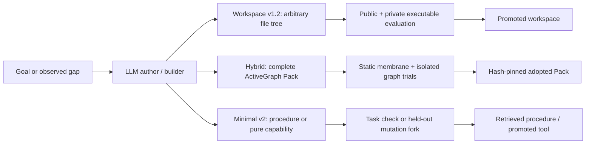

# Architecture comparison

Snapshot: 2026-07-16. Line counts include comments and CLI code and are useful
only as an order-of-magnitude measure.

## The three ideas in plain language

**Workspace v1.2 is a city rebuilder.** Give it land, a goal, and inspectors;
it can replace nearly every building. This makes it broadly powerful, costly,
and difficult to prove safe. The recovered kernel is 3,564 lines plus 1,354
test lines.

**Minimal v2 is an apprentice with a notebook and tool belt.** One persistent
model actor performs work, remembers successful procedures, and can add small
deterministic tools. It feels most like one continuing agent and is easiest to
demo conversationally. The current kernel is 1,531 lines plus 478 test lines.

**Hybrid Packs is an organism that grows hash-pinned organs.** A powerful model
may propose a complete ActiveGraph Pack—types, relations, and behaviors—but an
immune-system-like manager decides whether the organ is safe and actually
improves behavior. The pack manager is 1,167 lines; the docs-grounded author
and recorder add 724 lines; their focused tests total 584 lines. The shared
broker, agent, grader, sandbox, and runner are research infrastructure and are
reported separately from all three kernels.

## High-level architecture

All three separate proposal from release authority. Their central disagreement
is the mutation unit.

## Technical comparison

| Property | Workspace v1.2 | Hybrid Packs | Minimal v2 |
|---|---|---|---|
| Persistent identity | ActiveGraph run + promoted workspace lineage | ActiveGraph event log + adopted Pack registry | ActiveGraph run + procedures + capabilities |
| Mutation unit | Arbitrary workspace tree | Complete ActiveGraph Pack | Procedure text or pure JSON capability |
| Author action | Multi-turn coding with file/command tools | One atomic proposal containing one to six composed Packs | Generic tool loop or one structured mutation proposal |
| Evaluation | Executable public/private tests + gates + judge | Static pre-import gate + fresh-process public/private graph trials | External task check or held-out subprocess fork |
| Adoption | Copy promoted workspace; optional next engine | Copy exact bundle; load only after restart | Store procedure or promote exact Pack-backed capability |
| Native state | Anything the workspace implements | Typed objects/relations in the organism graph | Event history, procedure objects, host workspace |
| External authority | Sandboxed commands; optional network/pip flags | None in current autonomous envelope | Six brokered host tools; generated capabilities stay pure |
| Expressive ceiling | Highest | High inside ActiveGraph's behavior model | Moderate structural, high runtime tool use |
| Auditability | Lowest of the three | Highest for structural behavior | Highest conceptual legibility |
| Main risk | Huge search/safety surface | Generated Python and incomplete policy membrane | Mistaking memory/tool learning for structural self-improvement |

## Strengths and weaknesses

### Workspace v1.2

Strengths:

- Can build real multi-file software, tests, CLIs, services, and potentially a
  successor engine.
- Evaluates executable artifacts rather than individual functions.
- Manager-private suites have already caught impressive-looking overfitting.
- Best baseline for the “hypothetically anything” part of the story.

Weaknesses:

- Its size and ceremony obscure the minimal recursive idea.
- Broad file and command authority produces the largest containment problem.
- Objective compilation can accidentally narrow a vague goal into a small
  deterministic protocol.
- Many LLM/tool calls make it slower and more expensive.
- Promoting a better product workspace is not necessarily changing the
  organism that creates future workspaces.

### Hybrid Packs

Strengths:

- The mutation unit is much more expressive than one function but much more
  inspectable than an arbitrary repo.
- ActiveGraph types, relations, patterns, policies, prompts, and behaviors are
  natural building blocks for qualitatively different acquired behavior.
- The LLM now has the actual framework documentation, not a toy source template.
- Source proposal is sharply separated from static policy, hidden evaluation,
  byte-pinned adoption, and cold loading.
- It provides the cleanest showcase of ActiveGraph as both substrate and the
  language of growth; it does not depend on the `activegraph-packs` repository.

Weaknesses:

- The author now has a bounded repair loop, but only static-gate and public-test
  diagnostics can be returned; it has not been live-tested on tasks that
  actually require repair.
- The import membrane blocks common authority expansion but is not a security
  proof against adversarial Python.
- Native adopted Packs remain deterministic and local; model and workspace
  authority are available only through the outer host broker.
- Atomic multi-Pack proposals now support coordinated graph behavior, but the
  manager and authoring algorithm themselves are still outside that mutation unit.
- Three successful pilots show acquisition, not reliability or recursion.

### Minimal v2

Strengths:

- The clearest “one agent that persists and learns” experience.
- Coding, chat memory, procedures, and deterministic capability promotion share
  one compact runtime story.
- Host-owned tools keep credentials and high-risk authority out of generated
  code.
- Excellent open-source demo surface because users can understand the loop.

Weaknesses:

- Structural mutations are intentionally limited to pure JSON functions.
- Learned procedures are retained after success, but their causal value on
  future tasks is not yet measured.
- Without an external check, open-ended completion rests on the actor's claim.
- The dual mutation story—soft procedures plus hard capabilities—is less
  visually dramatic than whole-Pack growth.

## Power, danger, and novelty

The most powerful unrestricted architecture is workspace v1.2. The most
compelling balance for the intended story is the hybrid: the model can write a
whole new behavioral organ, while the organism's manager withholds release
authority. Minimal v2 is the strongest teaching artifact and live-agent demo.

The defensible novelty claim is not “the first self-improving AI.” It is:

> A minimal, event-sourced agent that can propose, privately test, hash-pin,
> adopt, and cold-load new graph-native behavioral Packs under an explicit
> authority boundary.

The dangerous feeling comes from real code generation and durable adoption,
not from hiding the governance. Every line should make either growth or its
containment visible.

## Recommendation

Keep all three as research baselines, but make Hybrid Packs the flagship
structural-evolution path:

- minimal v2 is the approachable front door and “single living agent” demo;
- hybrid is the serious claim about acquiring qualitatively new behavior;
- workspace v1.2 is the high-ceiling control and source of evaluator lessons.

Do not merge them into one giant kernel yet. First use the shared protocol to
learn which mutation unit actually produces reliable transfer and, crucially,
which one can pass the recursive-bootstrap ablation.
